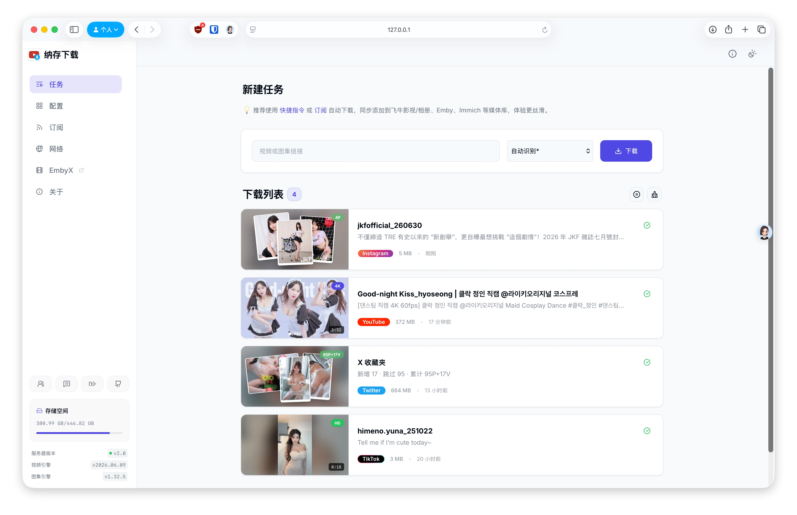

# 纳存下载 (NASave-DL)
> 纳万物，存光影。 One-click to NAS, Save it all.



「**纳存下载**」是运行在 NAS 上的多合一媒体下载服务器，通过快捷指令或订阅功能，一键将网络资源保存到 NAS，自动整理归档，完美兼容飞牛影视/相册、Emby、Immich 等媒体库的元数据。
- 纳存下载的 NFO 专为 EmbyX 定制优化，推荐搭配使用 ➡️ [EmbyX](https://github.com/juneix/EmbyX)


⚠️ 音乐下载因为版权问题比较繁琐，暂不考虑整合。  

## ✨ 特色亮点

- **🎬 视频下载**：yt-dlp 引擎，支持数千个视频网站

- **📷 图集下载**：gallery-dl 引擎，支持等数百个图片网站

- **🔧 开箱即用**：支持 Web 界面管理模板、Cookies 等配置

- **🚀 自动订阅**：定期更新，自动下载订阅内容

- **🔁 自动整理**：分类归档，写入 NFO、XMP 元数据

- **🔔 通知推送**：Bark、Server酱³ 接入系统原生通知

- **⚡️ API 驱动**：提供标准接口，方便对接快捷指令等自动化

- **🌐 跨平台**：现已支持 Docker、飞牛、Mac、PC、安卓客户端 🎉（鸿蒙考虑中）
> 2.0 版本重构，暂时只支持 Docker，其他平台即将支持

## 🧩 元数据适配
🎨 以下平台已深度定制优化，其他网站支持通用解析

| 网站     | 视频 NFO | 图片 XMP | 备注        |
|:--------:|:--------:|:--------:|:-----------:|
| YouTube  |    ✅    |    🚫    | 建议登录    |
| Instagram|    ✅    |    ✅    | /           |
| Twitter/X|    ✅    |    ✅    | /           |
| TikTok   |    ✅    |    🚫    | /           |
| 哔哩哔哩 |    ✅    |    🚫    | 4K 需大会员 |
| 小红书   |    ✅    |    🚫    | 4K 需登录   |
| 抖音     |    🚫    |    🚫    | 暂不支持    |
| 通用网站 |    ☑️    |    ☑️    | 可导出 JSON |


## ❤️ 支持项目

- 打赏鼓励：支持我开发更多有趣应用
- 互动群聊：加入 💬 [QQ 群](https://qm.qq.com/q/KhRMpYLnGi) 可在线催更
- 更多内容：访问 ➡️ [谢週五の藏经阁](https://5nav.eu.org)

<div align="center">
  <table>
    <tr>
      <td align="center">
        <br/>
        <sub>微信</sub>
      </td>
      <td align="center">
        <br/>
        <sub>支付宝</sub>
      </td>
    </tr>
  </table>
</div>


## 🚀 快速开始

### 🐳 方式一：Docker 部署 (推荐，适合 NAS)
官方镜像已发布至 GitHub 和 Docker hub，支持 `x64` 和 `arm64` 架构。

```
services:
  nasave-dl:
    image: ghcr.io/juneix/nasave-dl
    # DockerHub 源: juneix/nasave-dl
    # 国内加速源: docker.1ms.run/juneix/nasave-dl
    container_name: nasave-dl
    network_mode: host # 使用 Host 网络
    restart: always
    environment:
      - TZ=Asia/Shanghai
      - PORT=8888 # 自定义端口
    volumes:
      - ./data:/app/data # 配置文件、cookies 文件等
      - /volume1/downloads:/downloads # 下载文件夹
      - /etc/machine-id:/host/etc/machine-id:ro # 宿主机机器码挂载
```
